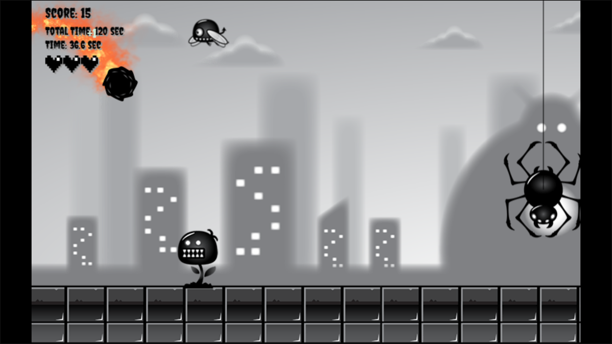

# Dog-of-War 2D Game

Welcome to the Dog-of-War 2D Game!

## Description

Dog-of-War 2D is an exciting and action-packed game that puts you in the paws of a determined dog warrior. Embark on a thrilling adventure through various levels filled with challenges, enemies, and special abilities.

## Controls

### Keyboard Controls
- &#8592;: Move Left
- &#8593;: Jump
- &#8594;: Move Right
- &#8595;: Splash from the Air / Sit on the Ground
- "Enter" Key: Perform Special Attack (Rolling)

### Mobile Controls
- Swipe Left: Move Left
- Swipe Up: Jump
- Swipe Right: Move Right
- Swipe Down: Splash from the Air / Sit on the Ground
- Double Tap on Screen: Perform Special Attack (Rolling)

## How to Play

1. Choose your preferred control method – keyboard or mobile.
2. Navigate levels using the controls to move, jump, and perform actions.
3. Engage enemies and use special attacks to overcome challenges.
4. Complete levels, defeat enemies, and progress through the game.

## Play Online

Visit the [Dog-of-War 2D Game Website](https://certificationsurya.github.io/Dog-of-War_2d_Game/) to play the game on your browser.

## Feedback

We value your feedback! Contact us for questions, suggestions, or issues.

Enjoy the adventure in **Dog-of-War 2D** and unleash your inner dog warrior!

